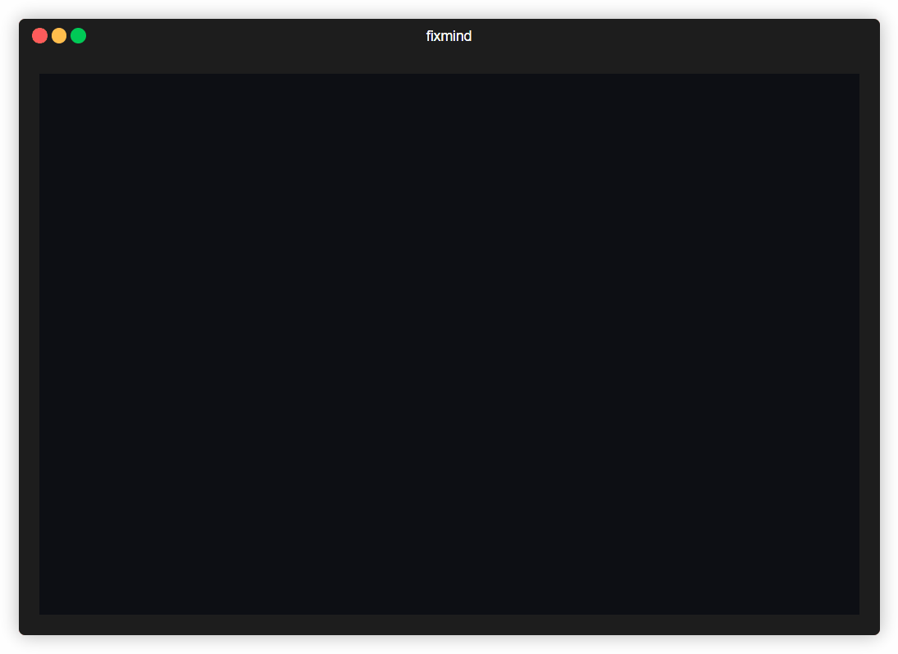

# fixmind

[](LICENSE)
[](https://nodejs.org)

A local-first CLI and MCP server that turns every AI-assisted bug fix into a lesson you actually remember. No paid AI API, no account required — everything lives in a SQLite database on your machine. Encrypted sync across machines is available as an opt-in Pro feature.



## Quick start

```bash
npx fixmind setup
```

`npx fixmind setup` detects Claude Code, Cursor, and Codex, and wires the MCP server into whichever ones you pick — globally on this device, or scoped to a single project with `--scope project`. Full usage lives in [packages/core/README.md](packages/core/README.md).

## Documentation

| Doc | Covers |
|---|---|
| [docs/quickstart.md](docs/quickstart.md) | Install, setup, and what happens on your first fix. |
| [docs/cli-reference.md](docs/cli-reference.md) | Every command and flag — setup, capture, browse, review, edit, export. |
| [docs/lesson-schema.md](docs/lesson-schema.md) | What a lesson contains, the quality gate that rejects shallow ones, the spaced-repetition schedule, and where it's all stored. |
| [docs/faq.md](docs/faq.md) | Troubleshooting: agents not saving lessons, backups, resets, scope quirks per client. |
| [packages/core/docs/mcp-integration.md](packages/core/docs/mcp-integration.md) | The MCP server itself — the tool schema, token overhead, configuring clients fixmind doesn't autodetect. |
| [CHANGELOG.md](CHANGELOG.md) | Notable changes to the published `fixmind` package. |

## Repository layout

This is an npm workspaces monorepo.

| Path | What it is |
|---|---|
| [`packages/core`](packages/core) | The published `fixmind` package — the CLI and MCP server. |
| [`packages/dashboard`](packages/dashboard) | `@fixmind/dashboard`, the React dashboard SPA bundled into `packages/core`'s build. |
| [`apps/website`](apps/website) | `@fixmind/website`, the marketing site (Vite + React + Tailwind). |
| [`apps/desktop`](apps/desktop) | Reserved for a future Tauri desktop shell wrapping the dashboard — not yet built. |

## Working in this repo

```bash
npm install        # install all workspaces
npm run build      # build dashboard, core, and the website
npm test           # run packages/core's test suite
```

See [CONTRIBUTING.md](CONTRIBUTING.md) for the full setup, the per-workspace commands, and how to submit a change.

## License

MIT — see [LICENSE](LICENSE).
